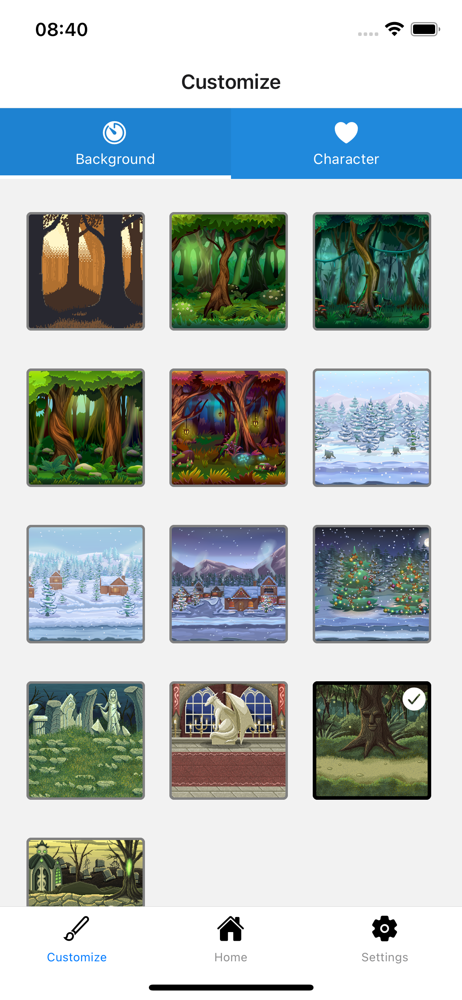
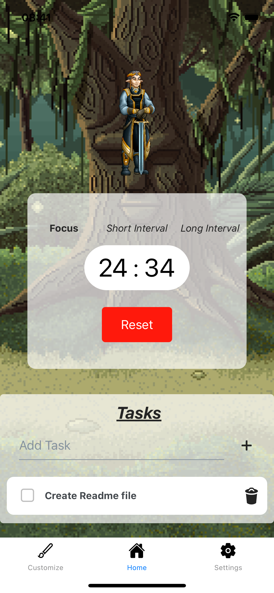

<!-- PROJECT LOGO -->
<br />

<div align="center">
  <h1 align="center">Gaming Pomodoro</h3>


  <a align="center" href="/">
    
    
  </a>

</div>

<!-- ABOUT THE PROJECT -->
## About The Project

Pomoro app developed with React Native. This app is a pomodoro timing developed with a fantasy / gaming interface where you can customize the interface and config the time for each interval.


### Built With


## :books: Requirements
- To have [**Git**](https://git-scm.com/) installed to clone the repository.
- To have [**Node.js**](https://nodejs.org/en/) installed.
- An iOS or Android device or emulator.

## :rocket: Getting started
``` bash
  # Clone the repository:
  $ https://github.com/renanfeluck/gaming-pomodoro
  # Enter directory:
  $ cd gaming-pomodoro
  
  # Install dependencies:
  $ npm i
```

## Contributing

1. Fork it (<https://github.com/renanfeluck/gaming-pomodoro/fork>)
2. Create your feature branch (`git checkout -b feature/fooBar`)
3. Commit your changes (`git commit -am 'Add some fooBar'`)
4. Push to the branch (`git push origin feature/fooBar`)
5. Create a new Pull Request


## Credits

Developed by [Renan Felipe](https://github.com/renanfeluck)
